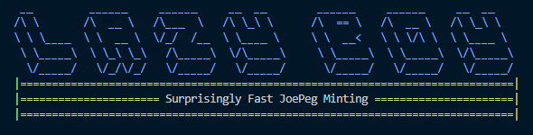
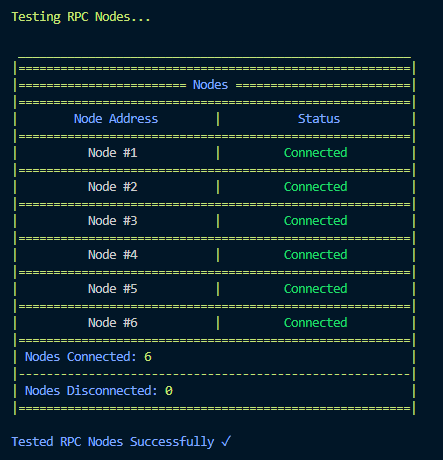
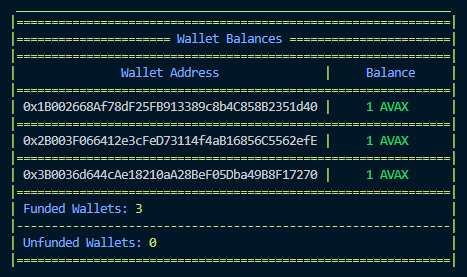

# Lazy Boy Minter 💤
Minting is fun until you realize you're competing against scripts. If you can't beat 'em, join 'em. *beep boop bop* [Currently reworking mint/scan for parallel processing]



## How does it work?
The script requires 3 main components in order to be successful:
1. **Lazy Boyz** - Private Keys that you must provide in order for the script to call information on chain as well as transact
2. **Nodes** - RPC http endpoints for the Avalanche (or Fuji) networks
3. **Contract** - The address of the Launchpeg contract that you wish to bot


The core strategy of this bot is taken from [@twitt_tr's](https://twitter.com/twitt_tr) (tactical_retreat) Substack article, [Building an (advanced) NFT bot](https://tacticalretreat.substack.com/p/building-an-advanced-nft-bot). In it, they describe a strategy which they dub 'propagating'. This is the Lazy Boyz strategy in beating out other bots and manual users still clicking buttons (they never stood a chance anyway). 

Propagating, as I assume it's name was taken from, is like planting as many seeds as possible and hoping that just a handful, or one, make it to blooom. In this script, our seeds are our transactions that we send in an attempt to mint. The network, our soil, and RPC nodes our trowels. By spamming the mint() function as many times as possible, to as many different nodes as possible, we are *ahem* spreading our seed as wide as possible. Giving us a higher probability that one, or multiple, of our mint transactions actually land on-chain.

For even better probability, one could configure as many different RPC nodes and wallets that they could afford to fund and create an even bigger net than the one the Lazy Boyz cast. 

**More Attempts = More Tx Spam = Higher Probability of Success**

## Setup


The Lazy Boy Minter is written in Python and as such, requires minimal setup to get going. However, there are still external libraries that you will need both Python and ```pip``` installed on your machine in order to retrieve. These include:

**Necessary packages**
- ```python-dotenv```: How we store our Private Keys and RPC URL's
- ```web3```: How we are able to interact with the Avalanche Network
- ```eth_account```: How we are able to create instances of wallet accounts
- ```colorama```: How we make everything look doooope.

In order to install these, within the main directory of the repository, use the following command:

```pip install <library name>```

Once you have all of the necessary packages installed, you will need to configure a .env file:

1. Create a file named ```.env``` in the main directory of this repository
2. Copy and paste the contents of the ```.env-example``` file into the ```.env``` file
3. Fill in each variable using your own information

Note that you will have to append your Private Keys with '0x' for the script to work. This will look something like

**Example**
LAZY_BOY_ONE='0xasdhkl2j3h4389hd....'

If you would like to use less Nodes or Private Keys to mint, you can simply delete the unused variables in ```.env``` as well as ```lazy_boy_minter.py```

If you would like to use more Nodes or Private Keys to mint, you can add them into ```LazyBoyz``` and ```Nodes``` in the ```lazy_boy_minter.py```. To make those changes in the actual script, use the following snippets to do so within the respective code:

**Nodes**
```Node(os.getenv(<NODE_ADDRESS_NAME>))```

**Private Keys**
```LazyBoy(private_key=os.getenv(<PRIVATE_KEY_NAME>))```

## Usage


Once you have made sure that everything has been configured using the above steps, you are all set to begin minting with the Lazy Boyz. To start the script you can use either:

```python lazy_boy_minter.py```

**OR** you can use the "Run without Debugging" option if you are using VSCode

Once started, the user will be prompted to answer whether or not they are ready to start minting. Once ```yes``` is input, the script will begin initial configuration. 

If the configuration is successful, you should first see a table showing all of the RPC connections that the script was able to make:



If the script was not able to cnnect to any of the RPC URL's that you provide, you will get an error message prompting you to check that you have configured it correctly within the script-as well as that it is currently operating.

After successfully checking the RPC connections, the script will continue to check the balance of each wallet that was provided. If all of the wallets are funded, you will see a table similar to this:



After the script has verified that all information provided was integrated, wallets are funded, and each RPC is connected, it will prompt the user to respond with whether or not they would like to start scanning for the ```Initalized``` event in the contract that was specified as the ```JOEPEG_ADDRESS``` in the ```.env``` file. Respond ```yes``` here as well if you are ready to get Lazy.

Once the script has been prompted to continue, it will scan the most recent blocks for the ```Initialized``` event from our victim contract. Once the event has been found, the bot will attempt to mint using the signers that were generated using the Nodes and Private Keys supplied by the user.

## Disclaimer
This script is not guarenteed to work for you, neither is it as competitive as possible. If you want something that is more highly optimized, I would take the general framework of the script and add in your own customizations. This is supposed to serve as a proof of concept, and often sarcrifices functionality/readability for aesthetic.

I wrote this to teach myself Python-it aint pretty but it works. Some of the readability of the code has also been sacrificed to provide better console outputs. In those areas, I have provided *trimmed* versions of each function so that the actual utility of the function can more easily be identified.

## Reach Out
Have some questions about the script? The quickest way I will see it is if you open up an issue within the repo. Please be descriptive of your issue and provide screenshots!

Twitter: [@AltLoot](https://twitter.com/AltLoot)


